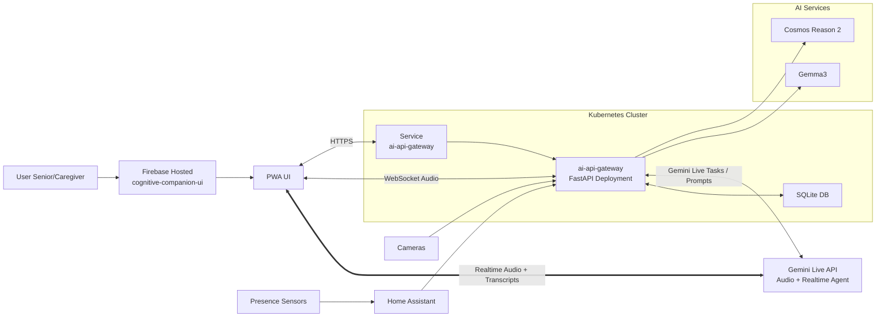

# Cognitive Companion with Gemini Live

A privacy-first AI watchdog for multigenerational households, designed to support seniors facing early cognitive decline while preserving their independence and dignity.

[▶️Long Introduction + Demo Video (8 minutes)](https://www.youtube.com/watch?v=l4DnkE6N7Lc)

[▶️Short 4-minute Demo Video](https://www.youtube.com/watch?v=hIe1BMhOk3Y)

## UI

A [Progressive Web App](https://github.com/c-ram/cognitive-companion-gemini-ui) with:
  - Live transcripts and audio playback of Gemini Live responses.
  - Visual alert images.
  - Emergency alerts with “I am okay” / “Need assistance” actions and auto-escalation.
  - An audio visualizer + VAD calibration for mic input.

## Philosophy

Cognitive decline doesn't have to mean loss of independence. Cognitive Companion acts as a careful, unobtrusive presence in the home, watching for situations where a gentle reminder or nudge might help, without automating away the small acts of daily life that give seniors agency and routine.

Rules are written in natural language and evaluated by on-premise vision and language models, so the system understands *context* rather than just triggering on rigid conditions.

### Tamil language support

Feedback is delivered in Tamil, the language that is natural and familiar to the members of this household. Interactions are handled via the Google Gemini Live API


## Architecture Overview

```
Cameras / Presence Sensors
      │
      ▼
 FastAPI Gateway  ──►  MinIO (media storage)
      │
      ├──► VLLM - Cosmos Reason2 (vision reasoning)
      ├──► Ollama - Gemma3  (logic & feedback)
      └──► Google Gemini Live  (Live Agent) ──► Multi-modal interaction via Progressive Web Application
```

- **Rules engine** - configurable natural language rules with time-of-day and room-location contexts
- **Gradio console** - internal debug UI for rules, sensors, vision, and translation
- **Scheduler** - APScheduler runs periodic rule evaluations against live camera feeds
- **WhatsApp** - optional caretaker notifications via WhatsApp Business API
- **Email-to-SMS** - optional caretaker notifications via carrier SMS gateway email


### Architecture Diagram


## Prerequisites

| Service | Purpose |
|---------|---------|
| **Kubernetes** (MicroK8s or similar) | Hosts the API gateway |
| **MinIO** | Object storage for captured media and audio clips |
| **Home Assistant** | Audio playback via media player integration |

### AI Endpoints

| Environment Variable | Model | Notes |
|---------------------|-------|-------|
| `VLLM_COSMOS_API_URL` | `nvidia/Cosmos-Reason2-8B` | Vision-language reasoning; served via vLLM |
| `OLLAMA_API_URL` | `gemma3:27b` | Logic evaluation and feedback generation; served via Ollama |
| `GEMINI_API_KEY` | `` | Live Agent Interaction |

All endpoints must expose an OpenAI-compatible `/v1/` API.

## Deployment

### 1. MinIO

Create the bucket and note your credentials:

```bash
# create bucket (adjust endpoint as needed)
mc alias set local http://<minio-host>:9000 <access-key> <secret-key>
mc mb local/ai-media
```

Edit `kubernetes/configmap-minio.yaml` and set the minio configs and keys:

```yaml
apiVersion: v1
kind: ConfigMap
metadata:
  name: minio-config
  labels:
    app: ai-api-gateway
data:
  MINIO_ENDPOINT: "<end-point>:80"
  MINIO_BUCKET_NAME: "ai-media"
  MINIO_SECURE: "false"
---
apiVersion: v1
kind: Secret
metadata:
  name: minio-secret
  labels:
    app: ai-api-gateway
type: Opaque
stringData:
  MINIO_ACCESS_KEY: "<ACCESS_KEY>"
  MINIO_SECRET_KEY: "<SECRET_KEY>"

```

### 2. Configure the Deployment

Edit `kubernetes/deployment.yaml` and set the AI endpoint URLs to match your infrastructure:

```yaml
env:
  - name: VLLM_COSMOS_API_URL
    value: "http://<cosmos-host>:8000/v1/"
  - name: GEMINI_API_KEY
    value: "replace_me"
  - name: OLLAMA_API_URL
    value: "http://<ollama-host>:11434/v1/"
  - name: HOME_ASSISTANT_URL
    value: "http://homeassistant.local:8123"
  - name: HOME_ASSISTANT_TOKEN
    value: "<long-lived-access-token>"
  - name: SMTP_HOST
    value: "smtp.gmail.com"
  - name: SMTP_PORT
    value: "587"
  - name: SMTP_USE_TLS
    value: "true"
```

Create the SMTP secret for Gmail/Google Workspace credentials:

```bash
kubectl apply -f kubernetes/secret-email.yaml
```

### 3. Build and Push the Image

```bash
# builds and pushes to the local MicroK8s registry by default
./build_image.sh
```

### 4. Deploy

```bash
kubectl apply -f kubernetes/configmap-minio.yaml
kubectl apply -f kubernetes/secret-email.yaml
kubectl apply -f kubernetes/deployment.yaml
kubectl apply -f kubernetes/service.yaml
```

Check that the pod is running:

```bash
kubectl get pods -l app=ai-api-gateway
kubectl logs -f deployment/ai-api-gateway
```

The API gateway will be available on port `8100`.

### 5. Run the Debug Console (optional)

```bash
cd cognitive-companion
pip install -r requirements.txt
python ui.py
```

Console available at `http://localhost:7860`.

---

## Configuration

All settings are read from environment variables (or a `.env` file in the project root):

| Variable | Description |
|----------|-------------|
| `VLLM_COSMOS_API_URL` | Cosmos reasoning endpoint |
| `GEMINI_API_KEY` | Gemini Live Agent API Key |
| `OLLAMA_API_URL` | Ollama endpoint |
| `HOME_ASSISTANT_URL` | Home Assistant base URL |
| `HOME_ASSISTANT_TOKEN` | Long-lived HA access token |
| `MINIO_ENDPOINT` | MinIO host:port |
| `MINIO_BUCKET_NAME` | Target bucket name |
| `MINIO_ACCESS_KEY` | MinIO access key |
| `MINIO_SECRET_KEY` | MinIO secret key |
| `SMTP_HOST` | SMTP host (e.g., `smtp.gmail.com`) |
| `SMTP_PORT` | SMTP port (usually `587`) |
| `SMTP_USE_TLS` | Use STARTTLS (`true`/`false`) |
| `SMTP_USERNAME` | SMTP username (email) |
| `SMTP_PASSWORD` | SMTP password (app password or OAuth token) |
| `SMTP_FROM` | From address (usually same as username) |

---

## Project Structure

```
cognitive-companion/
├── app.py                    # FastAPI application & routes
├── workflow.py               # Rule evaluation pipeline
├── scheduler.py              # APScheduler job management
├── database.py               # SQLite models (rules, sensors, contexts)
├── integrations.py           # TTS, Home Assistant, WhatsApp clients
├── sensor_polling.py         # Presence Sensor Polling Job and Rules
├── utils.py                  # VLLM/Ollama call helpers
├── minio_utils.py            # MinIO upload/download helpers
├── ui.py                     # Gradio debug console
├── config.py                 # Pydantic settings
├── routers/                  # FastAPI routers (rules, sensors, images)
  └── routers/ws_router.py    # Gemini Live Web Socket Handler
├── kubernetes/               # K8s deployment manifests
└── Dockerfile
```
